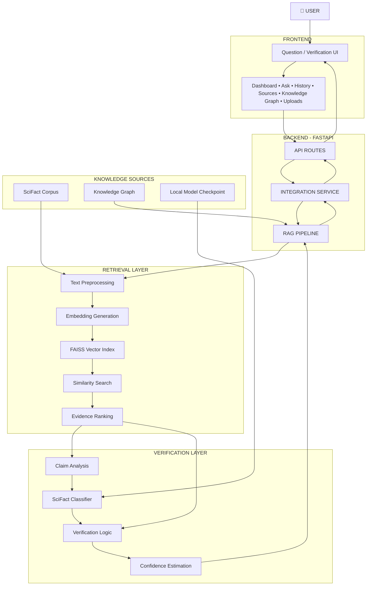
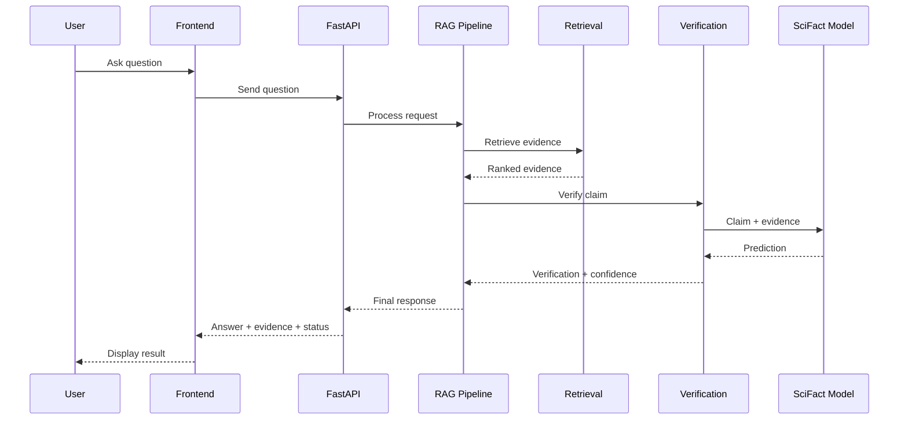
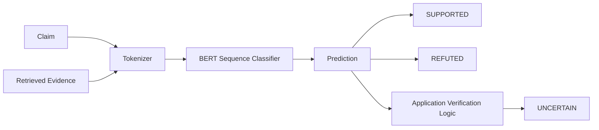
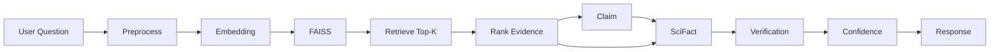

# 🛡️ AI Hallucination Mitigation System

<p align="center">
  <b>Evidence-Based AI Question Answering and Claim Verification</b>
</p>

<p align="center">
  Retrieve evidence → Verify claims → Estimate confidence → Generate reliable answers
</p>

---

## 📌 Overview

Large Language Models can generate answers that are fluent, convincing, and factually incorrect. These unsupported or fabricated statements are commonly known as **AI hallucinations**.

The **AI Hallucination Mitigation System** is designed to reduce this problem by introducing an evidence and verification layer between a user's question and the final response.

Instead of allowing an AI system to answer only from its learned knowledge, the proposed system follows an **evidence-first approach**:

```text
                 USER QUESTION
                       │
                       ▼
              ┌─────────────────┐
              │    RETRIEVAL    │
              │ Find evidence   │
              └────────┬────────┘
                       │
                       ▼
              ┌─────────────────┐
              │ EVIDENCE RANKING│
              │ Relevant context│
              └────────┬────────┘
                       │
                       ▼
              ┌─────────────────┐
              │ CLAIM VERIFIER  │
              │ SciFact model   │
              └────────┬────────┘
                       │
              ┌────────┴────────┐
              ▼                 ▼
        ┌───────────┐     ┌────────────┐
        │ SUPPORTED │     │  UNCERTAIN │
        └─────┬─────┘     └──────┬─────┘
              │                  │
              └────────┬─────────┘
                       ▼
              ┌─────────────────┐
              │   CONFIDENCE    │
              │    ESTIMATION   │
              └────────┬────────┘
                       │
                       ▼
              ┌─────────────────┐
              │ FINAL RESPONSE  │
              │ + Evidence      │
              │ + Sources       │
              └─────────────────┘
```

### Core principle

> **Do not simply generate an answer. Retrieve evidence, verify the claim, and communicate uncertainty when the evidence is insufficient.**

---

# 🎯 1. Problem Statement

Generative AI systems can produce:

- incorrect factual statements,
- fabricated information,
- unsupported claims,
- misleadingly confident answers,
- irrelevant or unrelated evidence,
- and citations that do not actually support the generated response.

This becomes especially problematic when users expect reliable information.

The project addresses the following problem:

> **How can an AI question-answering system reduce hallucinations by grounding responses in retrieved evidence and verifying factual claims before presenting the final answer?**

---

# 💡 2. Proposed Solution

The system combines multiple stages into a single pipeline:

```text
Question
   │
   ▼
Preprocessing
   │
   ▼
Semantic Retrieval
   │
   ▼
Relevant Evidence
   │
   ▼
Claim Verification
   │
   ▼
Confidence Estimation
   │
   ▼
Evidence-Based Response
```

The important difference from a conventional chatbot is that **retrieval and verification are explicit parts of the answering process**.

---

# 🎯 3. Objectives

The project aims to:

1. Reduce unsupported AI-generated statements.
2. Retrieve relevant evidence for a user question.
3. Use semantic similarity to identify useful documents.
4. Rank retrieved evidence according to relevance.
5. Verify factual claims using a SciFact-based model.
6. Distinguish supported, refuted, and uncertain situations.
7. Estimate confidence using evidence and verification signals.
8. Present evidence and sources alongside the response.
9. Provide a clean interface for question answering and verification.
10. Build a modular architecture that can be extended with additional retrieval and verification techniques.

---

# ✨ 4. Key Features

| Feature | Description |
|---|---|
| 🔎 Semantic Retrieval | Finds evidence related to the user's question |
| 📚 RAG Pipeline | Uses retrieved information as contextual evidence |
| ⚡ FAISS Search | Performs efficient vector similarity search |
| 🧪 SciFact Verification | Verifies scientific claims against evidence |
| 🛡️ Hallucination Mitigation | Rejects or reduces unsupported responses |
| 📊 Confidence Score | Indicates how strongly the evidence supports the result |
| ⚠️ Uncertainty Handling | Avoids forcing a confident answer when evidence is weak |
| 📑 Evidence Display | Shows the evidence used during verification |
| 🔗 Source Display | Makes the origin of evidence visible |
| 🕸️ Knowledge Graph | Provides structured concept relationships |
| 💬 Interactive Chat | Allows users to ask questions through the frontend |
| 🕘 History | Keeps previous question-answer interactions |
| 📂 Uploads | Provides a document upload workflow |
| ⚙️ Settings | Provides application configuration |

---

# 🏗️ 5. System Architecture

## 5.1 Complete Architecture



---

## 5.2 Layered Architecture

The system is divided into five major layers:

```text
┌────────────────────────────────────────────────────────────┐
│                    PRESENTATION LAYER                      │
│                                                            │
│   React / TypeScript / TanStack / Vite                     │
│   Dashboard • Ask • History • Sources • Graph • Uploads   │
└───────────────────────────────┬────────────────────────────┘
                                │
                                ▼
┌────────────────────────────────────────────────────────────┐
│                         API LAYER                          │
│                                                            │
│                       FastAPI                              │
│       Request Models • Routes • Health • Services         │
└───────────────────────────────┬────────────────────────────┘
                                │
                                ▼
┌────────────────────────────────────────────────────────────┐
│                    APPLICATION LAYER                       │
│                                                            │
│                    Integration Service                    │
│                       RAG Pipeline                         │
└───────────────────────────────┬────────────────────────────┘
                                │
                    ┌───────────┴───────────┐
                    ▼                       ▼
┌─────────────────────────────┐   ┌─────────────────────────┐
│      RETRIEVAL LAYER        │   │    VERIFICATION LAYER   │
│                             │   │                         │
│ Preprocessing               │   │ Claim Analysis          │
│ Embeddings                  │   │ SciFact Model           │
│ FAISS                       │   │ Verification Logic      │
│ Similarity Search           │   │ Confidence              │
│ Evidence Ranking            │   │ Uncertainty             │
└──────────────┬──────────────┘   └────────────┬────────────┘
               │                               │
               └──────────────┬────────────────┘
                              ▼
┌────────────────────────────────────────────────────────────┐
│                    KNOWLEDGE / DATA LAYER                  │
│                                                            │
│ SciFact Corpus • Local Model • Knowledge Graph             │
└────────────────────────────────────────────────────────────┘
```

---

# 🔄 6. End-to-End Workflow

The complete question-answering process is:



---

# 🔎 7. Retrieval Pipeline

Retrieval is the first major reliability layer.

## Retrieval flow

```text
User Question
      │
      ▼
┌───────────────┐
│ Preprocessing │
└───────┬───────┘
        │
        ▼
┌───────────────┐
│   Embedding   │
└───────┬───────┘
        │
        ▼
┌───────────────┐
│ FAISS Index   │
└───────┬───────┘
        │
        ▼
┌───────────────┐
│ Similarity    │
│ Search        │
└───────┬───────┘
        │
        ▼
┌───────────────┐
│ Top-K Evidence│
└───────┬───────┘
        │
        ▼
┌───────────────┐
│ Evidence      │
│ Ranking       │
└───────────────┘
```

### Why retrieval?

A verification model cannot verify information that is never supplied to it.

Therefore:

> **Retrieval quality directly affects verification quality.**

---

# ⚡ 8. FAISS Similarity Search

FAISS is used for efficient vector similarity search.

The basic process is:

```text
Documents
    │
    ▼
Text → Embeddings
    │
    ▼
Vector Index
    │
    │
Question → Embedding
    │
    ▼
Similarity Search
    │
    ▼
Top-K Documents
```

For normalized embeddings, inner-product similarity can correspond to cosine similarity.

The retrieval layer therefore provides candidate evidence for the downstream verification process.

---

# 🧪 9. Claim Verification

Retrieval alone is not enough.

A retrieved document may be:

- related but not actually supportive,
- partially relevant,
- contradictory,
- or unrelated.

The verification stage therefore evaluates the relationship between:

```text
CLAIM
  +
EVIDENCE
  ↓
VERIFICATION
```

---

# 🔬 10. SciFact Verification

The project uses a local SciFact-based sequence classification model for factual verification.

## Verification architecture



The current local checkpoint configuration determines the classifier labels.

For a two-class checkpoint:

```text
0 → SUPPORTED
1 → REFUTED
```

The application can additionally produce:

```text
UNCERTAIN
```

when the available evidence or verification confidence does not justify a definitive conclusion.

This distinction is important because **UNCERTAIN is an application-level reliability state, not necessarily a third neural classifier output**.

---

# 🛡️ 11. Hallucination Mitigation Logic

The system does not assume that every retrieved result is correct.

Instead:

```text
              RETRIEVED EVIDENCE
                       │
                       ▼
              ┌─────────────────┐
              │ Is evidence     │
              │ relevant?       │
              └────────┬────────┘
                       │
             ┌─────────┴─────────┐
             │                   │
            YES                  NO
             │                   │
             ▼                   ▼
       VERIFY CLAIM          UNCERTAIN
             │
       ┌─────┴─────┐
       │           │
   SUPPORTED    REFUTED
       │           │
       ▼           ▼
    Answer     Correct / Reject
```

This provides multiple opportunities to prevent unsupported information from reaching the user.

---

# 📊 12. Confidence Estimation

The confidence layer combines the available reliability signals.

Conceptually:

```text
Similarity
     │
     ├──────────────┐
     │              │
Evidence Coverage  │
     │              │
     ├──────────────┤
     │              │
Verification Result│
     │              │
     └──────┬───────┘
            ▼
     CONFIDENCE SCORE
            │
       ┌────┴────┐
       ▼         ▼
    Sufficient  Insufficient
       │         │
       ▼         ▼
    ANSWER    UNCERTAIN
```

A confidence score should be interpreted as a **system reliability signal**, not automatically as a calibrated probability.

Calibration must be experimentally measured before making stronger probabilistic claims.

---

# ⚠️ 13. Uncertainty Handling

One of the most important design decisions is allowing the system to say:

> **The available evidence is insufficient for a confident answer.**

Instead of:

```text
Weak Evidence
     ↓
Confident Answer ❌
```

the system should behave as:

```text
Weak Evidence
     ↓
Low Confidence
     ↓
UNCERTAIN
     ↓
Ask for better evidence / provide limited response
```

This is a central part of hallucination mitigation.

---

# 🕸️ 14. Knowledge Graph

The system includes a knowledge graph component for representing relationships between concepts.

Conceptually:

```text
                 ┌─────────────┐
                 │  Concept A  │
                 └──────┬──────┘
                        │
             ┌──────────┼──────────┐
             │          │          │
             ▼          ▼          ▼
          related     causes     part-of
             │          │          │
             ▼          ▼          ▼
        Concept B   Concept C   Concept D
```

The knowledge graph can support future:

- relationship-aware retrieval,
- multi-hop reasoning,
- entity linking,
- contradiction analysis,
- explainable reasoning paths.

It is designed as a complementary knowledge source rather than a replacement for evidence verification.

---

# 🖥️ 15. Frontend

The frontend provides the user-facing interface.

## Main application areas

```text
┌───────────────────────────────────────────────┐
│              AI HALLUCINATION                 │
│              MITIGATION SYSTEM                │
├───────────────┬───────────────────────────────┤
│               │                               │
│ Dashboard     │                               │
│               │       Main Workspace          │
│ New Verify    │                               │
│               │       Question                │
│ Ask Question  │       ↓                       │
│               │       Evidence                │
│ Knowledge     │       ↓                       │
│ Graph         │       Verification            │
│               │       ↓                       │
│ Sources       │       Confidence              │
│               │       ↓                       │
│ History       │       Final Answer             │
│               │                               │
│ Uploads       │                               │
│               │                               │
│ Settings      │                               │
└───────────────┴───────────────────────────────┘
```

The interface is designed around the idea that the answer should not be separated from the evidence behind it.

---

# 🧩 16. Backend Architecture

The backend is organized into separate responsibilities.

```text
backend/
│
├── api/
│   ├── app.py
│   ├── config.py
│   ├── dependencies.py
│   ├── middleware/
│   ├── models/
│   ├── routes/
│   ├── services/
│   └── utils/
│
├── preprocessing/
│   ├── embeddings.py
│   ├── preprocess.py
│   └── text_cleaning.py
│
├── retrieval/
│   ├── faiss_index.py
│   ├── rag_pipeline.py
│   ├── retrieve.py
│   └── scifact_documents.py
│
├── response_generation/
│   ├── formatter.py
│   └── generator.py
│
├── verification/
│   ├── knowledge_graph.py
│   ├── verifier.py
│   └── scifact/
│       ├── dataset_loader.py
│       ├── evaluate.py
│       ├── inference.py
│       ├── labels.py
│       ├── metrics.py
│       ├── model.py
│       ├── preprocess.py
│       ├── train.py
│       └── verifier.py
│
└── tests/
```

---

# 🔌 18. API Layer

FastAPI acts as the communication layer between the frontend and the AI pipeline.

## Basic architecture

```text
Frontend
   │
   │ HTTP
   ▼
FastAPI
   │
   ▼
Routes
   │
   ▼
Integration Service
   │
   ▼
RAG Pipeline
   │
   ├── Retrieval
   ├── Verification
   ├── Confidence
   └── Response
```

---

# ❤️ 19. Health Check

The backend exposes a health endpoint.

```text
GET /api/health
```

Expected response:

```json
{
  "status": "healthy",
  "service": "AI Hallucination Mitigation API"
}
```

A successful health response confirms that the API process is running and reachable.

It does not by itself prove that the complete question-answering pipeline is correct.

---

# 🧠 20. Complete Data Flow



---

# 🔁 21. RAG + Verification Architecture

The key architecture can be represented more simply as:

```text
                         ┌───────────────┐
                         │    QUESTION   │
                         └───────┬───────┘
                                 │
                                 ▼
                         ┌───────────────┐
                         │   RETRIEVER   │
                         └───────┬───────┘
                                 │
                                 ▼
                         ┌───────────────┐
                         │    EVIDENCE   │
                         └───────┬───────┘
                                 │
                   ┌─────────────┴─────────────┐
                   │                           │
                   ▼                           ▼
          ┌────────────────┐          ┌────────────────┐
          │   RAG CONTEXT  │          │ CLAIM + EVIDENCE│
          └───────┬────────┘          └───────┬────────┘
                  │                           │
                  │                           ▼
                  │                   ┌────────────────┐
                  │                   │ SciFact Model  │
                  │                   └───────┬────────┘
                  │                           │
                  │                   ┌───────┴────────┐
                  │                   ▼                ▼
                  │              SUPPORTED          REFUTED
                  │                   │                │
                  └─────────────┬─────┴────────────────┘
                                ▼
                       ┌─────────────────┐
                       │    CONFIDENCE   │
                       └────────┬────────┘
                                │
                                ▼
                       ┌─────────────────┐
                       │ FINAL RESPONSE  │
                       │ + EVIDENCE      │
                       │ + STATUS        │
                       └─────────────────┘
```

---

# 🛠️ 22. Technology Stack

## Frontend

```text
React
TypeScript
TanStack
Vite
Tailwind CSS
Radix UI
React Query
Recharts
Lucide
```

## Backend

```text
Python
FastAPI
Uvicorn
Pydantic
```

## AI / NLP

```text
PyTorch
Transformers
Sentence Transformers
NumPy
Scikit-learn
FAISS
```

## Verification

```text
SciFact
BERT Sequence Classification
Local Model Checkpoint
```

---

# 📦 23. Installation

## Requirements

Recommended:

```text
Python 3.10+
Node.js
npm
Git
```

Create the Python environment:

```powershell
py -3.10 -m venv venv
```

Activate it:

```powershell
.\venv\Scripts\Activate.ps1
```

Install backend dependencies:

```powershell
pip install -r backend\requirements.txt
```

---

# ▶️ 24. Running the Backend

From the project root:

```powershell
.\venv\Scripts\Activate.ps1
```

Set the Python path:

```powershell
$env:PYTHONPATH = "$PWD\backend"
```

Start FastAPI:

```powershell
python -m uvicorn api.app:app --host 127.0.0.1 --port 8000
```

Expected:

```text
Application startup complete.
Uvicorn running on http://127.0.0.1:8000
```

Check the root endpoint:

```text
http://127.0.0.1:8000/
```

Check health:

```text
http://127.0.0.1:8000/api/health
```

---

# ▶️ 25. Running the Frontend

Open another terminal.

```powershell
cd frontend
```

Install packages:

```powershell
npm install
```

Start the development server:

```powershell
npm run dev
```

Open the development URL shown by Vite.

---

# 🧪 26. Testing Strategy

Testing should cover every major stage.

```text
                    TESTING
                       │
        ┌──────────────┼──────────────┐
        ▼              ▼              ▼
      UNIT         INTEGRATION      E2E
        │              │              │
        ▼              ▼              ▼
 Retrieval        API → RAG       Frontend
 Verification     RAG → Verify   → API
 Confidence       Verify → Resp  → Answer
```

### Unit tests

Test:

- preprocessing,
- embeddings,
- retrieval,
- ranking,
- label mapping,
- verification,
- confidence,
- response formatting.

### Integration tests

Test:

```text
API
 ↓
Integration Service
 ↓
RAG Pipeline
 ↓
Retriever
 ↓
Verifier
 ↓
Response
```

### End-to-end tests

Test:

```text
User
 ↓
Frontend
 ↓
Backend
 ↓
Retrieval
 ↓
Verification
 ↓
Response
 ↓
Frontend
```

---

# 📈 27. Evaluation

The system should be evaluated using measurable metrics.

## Retrieval

```text
Precision@K
Recall@K
MRR
```

## Verification

```text
Accuracy
Precision
Recall
F1-score
Confusion Matrix
```

## Hallucination mitigation

Useful measurements include:

```text
Unsupported Claim Rate
Evidence Coverage
Factual Consistency
Citation Correctness
Uncertainty Accuracy
```

## Confidence

Possible calibration measurements include:

```text
Expected Calibration Error
Brier Score
Reliability Diagram
```

### Important

No accuracy, F1-score, hallucination reduction percentage, or improvement percentage should be reported unless it has actually been measured on a defined evaluation dataset.

---

# 📊 28. Current Development Validation

The following components have been validated during development:

| Component | Status |
|---|---:|
| Python environment | ✅ |
| Backend dependencies | ✅ |
| SciFact document loader | ✅ |
| SciFact corpus loading | ✅ |
| RAG pipeline import | ✅ |
| SciFact verifier import | ✅ |
| FastAPI startup | ✅ |
| Root API endpoint | ✅ |
| `/api/health` endpoint | ✅ |
| Frontend project structure | ✅ |
| Frontend development environment | ✅ |
| End-to-end response correctness | 🔄 Final regression testing required |
| Quantitative hallucination benchmark | 🔄 Evaluation required |

A previous development validation successfully loaded **5,183 SciFact documents** from the corpus.

The API health check successfully returned:

```text
status  : healthy
service : AI Hallucination Mitigation API
```

with HTTP status `200 OK`.

---

# ⚠️ 29. Important Development Finding

During integration testing, an incorrect response was observed where a question about Retrieval-Augmented Generation received an unrelated acid-rain response.

This is an important finding because it demonstrates that:

> **A running backend does not necessarily mean the AI pipeline is producing correct answers.**

The system therefore needs final regression testing across:

```text
Question
   ↓
API Request
   ↓
Query Processing
   ↓
Retrieval
   ↓
Evidence Ranking
   ↓
Claim Verification
   ↓
Confidence
   ↓
Response Generation
   ↓
Frontend Rendering
```

The final system should reject unrelated evidence rather than confidently returning it.

---

# 🚧 30. Limitations

### 1. Retrieval dependency

If the retriever returns poor evidence, downstream verification can also be affected.

### 2. Domain limitation

SciFact is focused on scientific claims. Its behavior may not generalize equally to every domain.

### 3. Dataset coverage

Questions outside the knowledge contained in the available corpus may produce insufficient evidence.

### 4. Confidence calibration

A raw confidence score should not automatically be interpreted as a mathematically calibrated probability.

### 5. Model dependency

Verification quality depends on the quality and compatibility of the local checkpoint.

### 6. Generation dependency

Even when evidence is available, response generation must remain grounded in that evidence.

---

# 🚀 31. Future Enhancements

Future versions can improve the system through:

```text
Hybrid Retrieval
      ↓
Keyword + Vector Search
```

```text
Better Claim Decomposition
      ↓
Multiple Claims per Response
      ↓
Individual Verification
```

```text
Knowledge Graph
      ↓
Multi-Hop Evidence
      ↓
Graph-Aware Verification
```

Other possible enhancements:

- stronger verification models,
- larger domain-specific corpora,
- web-based retrieval,
- source trust scoring,
- citation-level verification,
- multilingual support,
- improved confidence calibration,
- adversarial hallucination testing,
- persistent vector databases,
- evaluation dashboards,
- real-time monitoring.

---

# 🔬 32. Research Significance

The project focuses on an important reliability problem in modern generative AI.

Its central research direction is:

```text
GENERATIVE AI
      │
      ▼
      RAG
      │
      ▼
EVIDENCE RETRIEVAL
      │
      ▼
FACT VERIFICATION
      │
      ▼
CONFIDENCE
      │
      ▼
RELIABLE RESPONSE
```

The system demonstrates how retrieval and verification can be combined to make AI responses more transparent and evidence-oriented.

---

# 🧭 34. Design Philosophy

The project follows five principles:

### 1. Retrieve before answering

```text
No evidence → No confident answer
```

### 2. Verify factual claims

```text
Evidence ≠ automatic truth
```

### 3. Show the evidence

```text
Answer + Evidence
```

is better than:

```text
Answer only
```

### 4. Communicate uncertainty

```text
Insufficient evidence
        ↓
UNCERTAIN
```

### 5. Separate system responsibilities

```text
Frontend
   ↓
API
   ↓
Services
   ↓
Retrieval
   ↓
Verification
   ↓
Response
```

This makes the system easier to debug, evaluate, and extend.

---

# 🏁 35. Final System Concept

The complete project can be summarized as:

```text
┌──────────────────────────────────────────────────────────┐
│                                                          │
│                  AI HALLUCINATION                        │
│                     MITIGATION                           │
│                                                          │
│   ┌────────────┐                                         │
│   │  QUESTION  │                                         │
│   └─────┬──────┘                                         │
│         │                                                │
│         ▼                                                │
│   ┌────────────┐                                         │
│   │  RETRIEVE  │                                         │
│   └─────┬──────┘                                         │
│         │                                                │
│         ▼                                                │
│   ┌────────────┐                                         │
│   │  EVIDENCE  │                                         │
│   └─────┬──────┘                                         │
│         │                                                │
│         ▼                                                │
│   ┌────────────┐                                         │
│   │   VERIFY   │                                         │
│   └─────┬──────┘                                         │
│         │                                                │
│    ┌────┴─────┐                                          │
│    ▼          ▼                                          │
│ SUPPORTED  REFUTED                                       │
│    │          │                                          │
│    └────┬─────┘                                          │
│         │                                                │
│         ▼                                                │
│   ┌────────────┐                                         │
│   │ CONFIDENCE │                                         │
│   └─────┬──────┘                                         │
│         │                                                │
│    ┌────┴─────┐                                          │
│    ▼          ▼                                          │
│  ANSWER    UNCERTAIN                                     │
│    │          │                                          │
│    └────┬─────┘                                          │
│         ▼                                                │
│   ┌────────────┐                                         │
│   │  EVIDENCE  │                                         │
│   │  + SOURCE  │                                         │
│   └────────────┘                                         │
│                                                          │
└──────────────────────────────────────────────────────────┘
```

---

# ⭐ Core Message

<p align="center">
  <b>RETRIEVE → VERIFY → MEASURE → EXPLAIN</b>
</p>

<p align="center">
  The goal is not simply to make AI generate better answers.<br>
  The goal is to make AI answers <b>more evidence-grounded, transparent, and reliable.</b>
</p>
