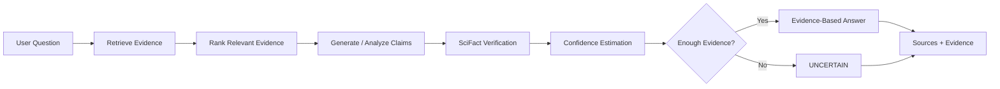
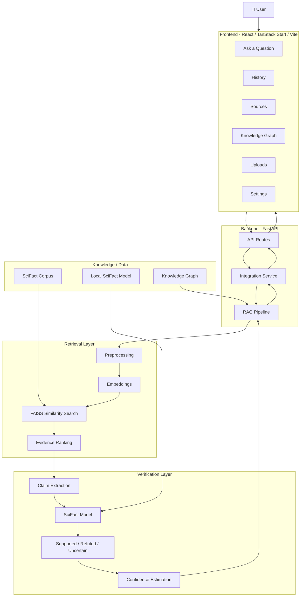
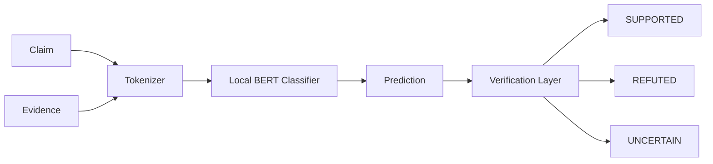
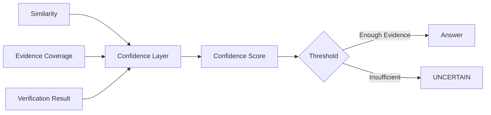

# 🛡️ AI Hallucination Mitigation System

<p align="center">
  
</p>

<h1 align="center">AI Hallucination Mitigation System</h1>

<p align="center">
  <b>An evidence-first AI question-answering system designed to detect, verify, and reduce hallucinated responses.</b>
</p>

<p align="center">
  
  
  
  
  
</p>

<p align="center">
  <i>Instead of asking an AI to answer from memory, this system makes it retrieve evidence, verify claims, estimate confidence, and communicate uncertainty.</i>
</p>

---

## 📌 Table of Contents

- [1. Project Overview](#1-project-overview)
- [2. Problem Statement](#2-problem-statement)
- [3. Why Hallucinations Matter](#3-why-hallucinations-matter)
- [4. Core Idea](#4-core-idea)
- [5. Objectives](#5-objectives)
- [6. Key Features](#6-key-features)
- [7. System Architecture](#7-system-architecture)
- [8. End-to-End Workflow](#8-end-to-end-workflow)
- [9. Verification Strategy](#9-verification-strategy)
- [10. Technology Stack](#10-technology-stack)
- [11. Project Structure](#11-project-structure)
- [12. Frontend](#12-frontend)
- [13. Backend](#13-backend)
- [14. Retrieval and RAG](#14-retrieval-and-rag)
- [15. SciFact Verification](#15-scifact-verification)
- [16. Confidence and Uncertainty](#16-confidence-and-uncertainty)
- [17. Knowledge Graph](#17-knowledge-graph)
- [18. API](#18-api)
- [19. Installation](#19-installation)
- [20. Running the System](#20-running-the-system)
- [21. Testing](#21-testing)
- [22. Evaluation](#22-evaluation)
- [23. Results and Current Validation](#23-results-and-current-validation)
- [24. Example Interaction](#24-example-interaction)
- [25. Research Contribution](#25-research-contribution)
- [26. Limitations](#26-limitations)
- [27. Future Enhancements](#27-future-enhancements)
- [28. Team Roles](#28-team-roles)
- [29. Reproducibility](#29-reproducibility)
- [30. Academic Context](#30-academic-context)
- [31. License](#31-license)

---

# 1. Project Overview

Large Language Models (LLMs) can produce fluent and convincing answers that are factually incorrect. These incorrect statements are commonly referred to as **AI hallucinations**.

The **AI Hallucination Mitigation System** is an evidence-based question-answering and verification platform designed to reduce this problem.

The central design principle is:

> **Retrieve first. Verify second. Answer third.**

Instead of relying only on the language model's internal knowledge, the system retrieves relevant evidence, evaluates whether claims are supported or refuted, calculates a confidence level, and exposes the evidence behind the answer.

The system combines:

- Retrieval-Augmented Generation (RAG)
- Semantic document retrieval
- FAISS-based similarity search
- SciFact-based claim verification
- Evidence ranking
- Confidence estimation
- Uncertainty handling
- Source/evidence presentation
- A React/TanStack frontend
- A FastAPI backend

---

# 2. Problem Statement

Traditional generative AI systems may generate responses that:

- contain fabricated facts,
- mix information from unrelated topics,
- cite sources that do not support the answer,
- express uncertainty as certainty,
- or produce plausible statements without evidence.

This creates a major reliability problem for systems intended for research, education, information retrieval, and decision support.

### Problem

> **How can an AI system generate useful answers while reducing unsupported or hallucinated factual claims?**

### Proposed approach

The project introduces an evidence-first pipeline:



---

# 3. Why Hallucinations Matter

A conventional chatbot may optimize for a fluent answer:

```text
Question
   ↓
Language Model
   ↓
Plausible Response
```

The proposed system adds a verification layer:

```text
Question
   ↓
Retrieve evidence
   ↓
Check evidence relevance
   ↓
Verify claims
   ↓
Estimate confidence
   ↓
Answer OR admit uncertainty
```

The goal is not to make the model "sound confident."

The goal is to make the system **deserve its confidence**.

---

# 4. Core Idea

The project can be summarized using the following principle:

## 🧠 From "Generate" to "Generate + Verify"

### Conventional approach

```text
User
 ↓
LLM
 ↓
Answer
```

### Proposed approach

```text
                 ┌─────────────────┐
                 │   User Question │
                 └────────┬────────┘
                          ↓
                 ┌─────────────────┐
                 │ Evidence Search │
                 └────────┬────────┘
                          ↓
                 ┌─────────────────┐
                 │ Relevant Context│
                 └────────┬────────┘
                          ↓
                 ┌─────────────────┐
                 │ Claim Verification│
                 └────────┬────────┘
                          ↓
                 ┌─────────────────┐
                 │ Confidence Check│
                 └───────┬─┬───────┘
                         │ │
                  Supported │ Insufficient
                         │ │
                         ↓ ↓
                     Answer
                       / 
                  Uncertainty
```

This design makes **evidence a first-class part of the answer**.

---

# 5. Objectives

The main objectives of the project are:

1. **Reduce AI hallucinations** by grounding generated responses in retrieved evidence.
2. **Retrieve relevant knowledge** from a factual document corpus.
3. **Rank evidence** according to semantic relevance.
4. **Verify factual claims** using a SciFact-based verification model.
5. **Classify claims** as supported or refuted where the model supports those labels.
6. **Handle uncertainty** when evidence is insufficient.
7. **Estimate confidence** using evidence and verification signals.
8. **Expose sources/evidence** to the user instead of hiding the basis of the answer.
9. **Provide an interactive frontend** for asking questions and inspecting evidence.
10. **Create an extensible architecture** that can later incorporate knowledge graphs, additional corpora, stronger verification models, and domain-specific sources.

---

# 6. Key Features

| Feature | Purpose |
|---|---|
| 🔎 Semantic Retrieval | Finds documents relevant to the question |
| 📚 RAG | Grounds responses using retrieved evidence |
| ⚡ FAISS Search | Efficient similarity-based retrieval |
| 🧪 SciFact Verification | Checks claim/evidence relationships |
| 🛡️ Evidence Filtering | Reduces unsupported answers |
| 📊 Confidence Score | Communicates reliability |
| ⚠️ Uncertainty Handling | Avoids forced answers |
| 🔗 Evidence/Sources | Shows supporting information |
| 🕸️ Knowledge Graph | Supports structured relationships and future reasoning |
| 💬 Ask Interface | Interactive question-answering |
| 🧾 History | Keeps previous interactions |
| 📂 Uploads | Provides a path for user-provided knowledge |
| 📈 Evaluation | Supports quantitative verification and retrieval evaluation |

---

# 7. System Architecture

## High-Level Architecture



---

# 8. End-to-End Workflow

## Step 1 — User asks a question

Example:

```text
What is retrieval augmented generation?
```

The frontend sends the question to the backend.

---

## Step 2 — API receives the request

FastAPI validates the request and forwards it to the application service layer.

```text
Frontend
   ↓
POST /api/...
   ↓
Request Model
   ↓
Integration Service
```

---

## Step 3 — Retrieve relevant evidence

The retrieval layer:

1. preprocesses the query,
2. creates/uses semantic representations,
3. searches the document index,
4. ranks candidate documents,
5. returns the most relevant evidence.

```text
Query
  ↓
Preprocessing
  ↓
Embedding
  ↓
FAISS Search
  ↓
Similarity Scores
  ↓
Top Evidence
```

---

## Step 4 — Analyze claims

The system identifies the factual claim that needs verification.

For example:

```text
Claim:
"RAG retrieves external documents and uses them as context for generation."
```

---

## Step 5 — Verify

The claim is compared with retrieved evidence through the SciFact verification layer.

Possible outcomes:

```text
SUPPORTED
REFUTED
UNCERTAIN
```

The exact classifier labels depend on the loaded checkpoint. The current local SciFact checkpoint is treated according to its actual configuration rather than assuming unsupported labels.

---

## Step 6 — Calculate confidence

Confidence combines available evidence and verification signals.

A low-confidence answer should not be presented as a highly certain fact.

---

## Step 7 — Generate final response

The response should be:

- relevant,
- evidence-grounded,
- transparent,
- and appropriately uncertain.

---

## Step 8 — Display evidence

The frontend presents:

```text
Answer
──────
Verification Status
Confidence
Evidence
Sources
```

This gives the user an opportunity to inspect the basis of the response.

---

# 9. Verification Strategy

The verification layer is designed around factual consistency.

## Verification states

### 🟢 SUPPORTED

The available evidence supports the claim with sufficient confidence.

### 🔴 REFUTED

The available evidence contradicts the claim.

### 🟡 UNCERTAIN

The evidence is insufficient, ambiguous, weak, or does not justify a confident conclusion.

The system should prefer:

```text
UNCERTAIN
```

over:

```text
Unsupported confident answer
```

---

# 10. Technology Stack

## Frontend

- React
- TypeScript
- TanStack Start / TanStack Router
- Vite
- Tailwind CSS
- Radix UI
- Lucide React
- React Query
- Recharts
- Sonner

## Backend

- Python
- FastAPI
- Uvicorn
- Pydantic
- PyTorch
- Transformers

## Retrieval / NLP

- Sentence Transformers / semantic embeddings where configured
- FAISS
- NumPy
- Scikit-learn
- NLP preprocessing

## Verification

- SciFact dataset
- BERT-based sequence classification
- PyTorch
- Hugging Face Transformers

## Development

- Git
- GitHub
- VS Code
- Python virtual environment
- npm / Bun-compatible frontend configuration

---

# 11. Project Structure

A representative structure is:

```text
AI_Hallucination_Mitigation/
│
├── backend/
│   ├── api/
│   │   ├── app.py
│   │   ├── config.py
│   │   ├── dependencies.py
│   │   ├── models/
│   │   ├── routes/
│   │   ├── services/
│   │   ├── middleware/
│   │   └── utils/
│   │
│   ├── preprocessing/
│   │   ├── embeddings.py
│   │   ├── preprocess.py
│   │   └── text_cleaning.py
│   │
│   ├── retrieval/
│   │   ├── faiss_index.py
│   │   ├── retrieve.py
│   │   ├── rag_pipeline.py
│   │   └── scifact_documents.py
│   │
│   ├── response_generation/
│   │   ├── formatter.py
│   │   └── generator.py
│   │
│   ├── verification/
│   │   ├── knowledge_graph.py
│   │   ├── verifier.py
│   │   └── scifact/
│   │       ├── dataset_loader.py
│   │       ├── evaluate.py
│   │       ├── inference.py
│   │       ├── labels.py
│   │       ├── metrics.py
│   │       ├── model.py
│   │       ├── preprocess.py
│   │       ├── train.py
│   │       └── verifier.py
│   │
│   ├── tests/
│   └── requirements.txt
│
├── frontend/
│   ├── public/
│   ├── src/
│   │   ├── components/
│   │   ├── hooks/
│   │   ├── lib/
│   │   ├── routes/
│   │   ├── data/
│   │   ├── router.tsx
│   │   ├── server.ts
│   │   ├── start.ts
│   │   └── styles.css
│   ├── package.json
│   ├── vite.config.ts
│   └── tsconfig.json
│
├── data/
│   └── scifact/
│       └── corpus.jsonl
│
├── models/
│   ├── scifact/
│   ├── scifact-base/
│   └── scifact-sanity/
│
├── notebooks/
│
├── tests/
│
├── README.md
├── requirements.txt
└── .gitignore
```

> Large datasets, downloaded model weights, virtual environments, caches, and generated artifacts should generally be kept outside Git unless project policy explicitly requires them.

---

# 12. Frontend

The frontend provides the user-facing interface for the verification system.

## Main screens

### 🏠 Dashboard

Provides a high-level view of the application.

### 💬 Ask a Question

Primary question-answering interface.

### 🧪 New Verification

Provides a dedicated verification workflow.

### 🕸️ Knowledge Graph

Visualizes relationships between concepts where graph data is available.

### 📚 Sources

Allows users to inspect evidence associated with responses.

### 🕘 History

Provides access to previous questions and answers.

### 📂 Uploads

Supports document/data upload workflows where implemented.

### ⚙️ Settings

Application configuration and user preferences.

### ℹ️ About

Project information.

---

# 13. Backend

The backend is implemented using FastAPI.

Its responsibilities include:

- request validation,
- API routing,
- application orchestration,
- retrieval,
- verification,
- response formatting,
- confidence calculation,
- history integration,
- health monitoring.

## Backend layers

```text
API Layer
   ↓
Service Layer
   ↓
RAG Pipeline
   ↓
Retrieval + Verification
   ↓
Response Formatting
```

This separation makes the system easier to test and extend.

---

# 14. Retrieval and RAG

## Retrieval-Augmented Generation

RAG connects generation with external evidence.

Instead of:

```text
Question → Model Memory → Answer
```

the system follows:

```text
Question
   ↓
Search
   ↓
Evidence
   ↓
Context
   ↓
Verification
   ↓
Answer
```

## Why retrieval matters

Retrieval provides a mechanism for:

- grounding responses,
- reducing unsupported claims,
- exposing evidence,
- updating knowledge without retraining the entire model,
- and separating knowledge retrieval from response generation.

---

## FAISS

FAISS is used for vector similarity search where configured.

Conceptually:

```text
Document
   ↓
Embedding
   ↓
Vector Index

Question
   ↓
Embedding
   ↓
Similarity Search
   ↓
Top-K Documents
```

For normalized vectors, inner-product similarity can be used as a cosine-similarity equivalent.

---

# 15. SciFact Verification

SciFact is used as the factual verification component of the project.

The verification task is based on comparing:

```text
Claim + Evidence
```

and determining whether the evidence supports or contradicts the claim.

## Model pipeline



### Important implementation detail

The local model checkpoint must always be interpreted according to its actual configuration.

If a checkpoint contains:

```text
0 → SUPPORTED
1 → REFUTED
```

it must not be treated as a three-class model merely because the application conceptually supports an `UNCERTAIN` state.

`UNCERTAIN` can be determined by the surrounding evidence/confidence logic when appropriate.

---

# 16. Confidence and Uncertainty

A reliable system should distinguish:

```text
High evidence
     ↓
High confidence
```

from:

```text
Weak evidence
     ↓
Low confidence
     ↓
UNCERTAIN
```

A conceptual confidence pipeline is:



The exact formula and thresholds should be documented in the implementation and evaluated empirically rather than presented as scientifically validated unless benchmark results support that claim.

---

# 17. Knowledge Graph

The project architecture also includes a knowledge graph component.

The original project direction uses structured knowledge and relationship extraction to represent concepts and their relationships.

A knowledge graph can represent:

```text
Concept A
    │
    ├── related_to ──> Concept B
    │
    ├── part_of ─────> Concept C
    │
    └── causes ──────> Concept D
```

This can support future improvements such as:

- relationship-aware retrieval,
- multi-hop reasoning,
- entity linking,
- contradiction detection,
- explainable evidence paths.

The graph should be treated as an additional evidence source rather than as a replacement for factual verification.

---

# 18. API

The backend exposes health and application endpoints through FastAPI.

## Health check

```http
GET /api/health
```

Expected response:

```json
{
  "status": "healthy",
  "service": "AI Hallucination Mitigation API"
}
```

## Root endpoint

```http
GET /
```

Expected behavior is a simple service status response.

## Question answering

The exact chat endpoint should be taken from the current backend route definition. The request conceptually contains:

```json
{
  "question": "What is retrieval augmented generation?"
}
```

and returns an evidence-oriented response containing fields such as:

```json
{
  "answer": "...",
  "verification_status": "SUPPORTED",
  "confidence_score": 0.0,
  "sources": [],
  "evidence": [],
  "claims": []
}
```

> The exact schema is defined by the project's Pydantic response models and should be treated as the source of truth.

---

# 19. Installation

## Prerequisites

Recommended environment:

- Python 3.10+
- Node.js
- npm
- Git
- Windows / Linux / macOS
- Sufficient storage for NLP models and datasets

---

## Clone

```bash
git clone <repository-url>
cd AI_Hallucination_Mitigation
```

---

## Backend environment

### Windows PowerShell

```powershell
py -3.10 -m venv venv
.\venv\Scripts\Activate.ps1
```

### Linux/macOS

```bash
python3 -m venv venv
source venv/bin/activate
```

Install dependencies:

```bash
pip install -r backend/requirements.txt
```

or, if the root dependency file is authoritative for the environment:

```bash
pip install -r requirements.txt
```

---

# 20. Running the System

## Terminal 1 — Backend

From the project root:

```powershell
.\venv\Scripts\Activate.ps1
$env:PYTHONPATH = "$PWD\backend"
python -m uvicorn api.app:app --host 127.0.0.1 --port 8000
```

Expected:

```text
Uvicorn running on http://127.0.0.1:8000
Application startup complete.
```

Check:

```text
http://127.0.0.1:8000/
```

and:

```text
http://127.0.0.1:8000/api/health
```

---

## Terminal 2 — Frontend

```powershell
cd frontend
npm install
npm run dev
```

Open the URL displayed by Vite.

For example:

```text
http://localhost:5173
```

Then open the Ask page:

```text
/ask
```

---

# 21. Testing

Testing should occur at multiple levels.

## Unit testing

Examples:

- preprocessing
- embedding generation
- retrieval
- ranking
- label mapping
- confidence calculation
- response formatting

## Integration testing

The complete pipeline should be tested:

```text
Question
 ↓
API
 ↓
RAG
 ↓
Retriever
 ↓
Verifier
 ↓
Response
```

## API testing

At minimum:

```text
GET /
GET /api/health
POST <question endpoint>
```

## Frontend testing

Verify:

- question submission,
- loading state,
- answer rendering,
- source rendering,
- confidence rendering,
- uncertainty state,
- history,
- navigation.

---

# 22. Evaluation

A serious hallucination-mitigation system should be evaluated quantitatively.

## Retrieval metrics

### Precision@K

Measures how many retrieved documents are relevant.

### Recall@K

Measures how much relevant evidence is successfully retrieved.

### MRR

Mean Reciprocal Rank measures how high the first relevant result appears.

---

## Verification metrics

For supported/refuted classification:

- Accuracy
- Precision
- Recall
- F1-score
- Confusion Matrix

Example:

```text
                 Predicted
              SUPPORTED REFUTED
Actual
SUPPORTED       TP        FN
REFUTED         FP        TN
```

---

## Hallucination metrics

A useful evaluation should measure:

- unsupported claim rate,
- evidence coverage,
- factual consistency,
- citation/evidence correctness,
- uncertainty calibration,
- answer relevance.

---

## Confidence evaluation

Confidence should ideally be evaluated using:

- calibration curves,
- reliability diagrams,
- Brier score,
- expected calibration error (ECE).

---

## Important research rule

Do **not** report an accuracy, F1-score, hallucination-reduction percentage, or improvement percentage unless it has actually been measured on a defined evaluation set.

---

# 23. Results and Current Validation

## Verified development results

During development, the following components have been successfully validated:

| Component | Status |
|---|---:|
| Python 3.10 environment | ✅ |
| Backend dependencies | ✅ |
| SciFact document loader | ✅ |
| RAG pipeline import | ✅ |
| FastAPI startup | ✅ |
| Root API | ✅ |
| `/api/health` | ✅ |
| Frontend startup | ✅ |
| Frontend → backend connectivity | ✅ |
| Evidence-grounded answer correctness | 🔄 Requires final regression validation |
| Quantitative hallucination benchmark | 🔄 Requires benchmark execution |

The development environment successfully loaded the SciFact corpus with **5,183 documents** during an earlier validation run.

The backend health endpoint returned:

```text
status: healthy
service: AI Hallucination Mitigation API
```

with HTTP `200 OK`.

### Important

At one point during integration testing, the UI returned an unrelated acid-rain response for a question about Retrieval-Augmented Generation. This exposed a genuine end-to-end correctness issue rather than an infrastructure issue.

That issue demonstrates why the project must validate:

```text
Question
→ API request
→ Retrieval
→ Evidence
→ Verification
→ Response
→ Frontend rendering
```

rather than considering "backend starts successfully" as proof of correctness.

The final project should only claim end-to-end success after this regression has been resolved and the test suite confirms that unrelated evidence is rejected.

---

# 24. Example Interaction

## Example A — Evidence-supported answer

```text
User:
What is retrieval augmented generation?

System:
RAG is a technique that retrieves relevant external
information and supplies it as context to a language
model before generating a response.

Verification:
SUPPORTED

Evidence:
[Relevant retrieved passage]

Confidence:
High
```

---

## Example B — Insufficient evidence

```text
User:
[Question outside available knowledge]

System:
The available evidence is insufficient to provide
a confident answer.

Verification:
UNCERTAIN

Evidence:
[Weak / insufficient evidence]

Confidence:
Low
```

This behavior is intentional.

The system should prefer:

> "I don't have enough evidence."

over:

> "Here is a plausible but unsupported answer."

---

# 25. Research Contribution

The project combines multiple reliability mechanisms into a single pipeline.

## Contribution 1 — Evidence-first answering

Answers are grounded in retrieved information rather than relying solely on generative model memory.

## Contribution 2 — Retrieval + verification

Retrieval alone does not guarantee correctness.

The project adds a separate verification stage.

```text
Retrieve
   +
Verify
   =
More reliable answering
```

## Contribution 3 — Explicit uncertainty

The system provides an uncertainty state instead of forcing every question into a confident answer.

## Contribution 4 — Explainability

Users can inspect evidence and sources behind the response.

## Contribution 5 — Modular architecture

The system separates:

```text
Frontend
Backend
Retrieval
Verification
Generation
Evaluation
```

This allows individual components to be improved independently.

---

# 26. Limitations

The current system has important limitations.

### Dataset limitations

The quality of answers depends on the quality and coverage of the available corpus.

### Retrieval limitations

A verifier cannot recover evidence that the retriever fails to retrieve.

```text
Bad retrieval
    ↓
Bad evidence
    ↓
Bad verification context
```

### Model limitations

The SciFact model is trained for scientific claim verification and may not generalize equally well to every domain.

### Confidence limitations

A confidence score is not automatically a calibrated probability.

Calibration must be experimentally evaluated.

### Knowledge graph limitations

A knowledge graph is only as useful as its entity extraction, relationship quality, and source reliability.

### Generative limitations

Even with retrieval and verification, response generation must remain constrained by evidence.

---

# 27. Future Enhancements

Possible future improvements include:

- 🔬 stronger claim decomposition,
- 🧠 larger and better-calibrated verification models,
- 🌐 multi-source web retrieval,
- 🕸️ graph-based multi-hop reasoning,
- 🔎 hybrid keyword + vector retrieval,
- 📚 domain-specific corpora,
- 🧮 learned evidence ranking,
- 📊 automated hallucination benchmarks,
- 🎯 confidence calibration,
- 🔐 source trust scoring,
- 🧾 citation-level verification,
- 🌍 multilingual support,
- ⚡ asynchronous retrieval,
- 🗄️ persistent vector databases,
- 📈 monitoring and evaluation dashboards,
- 🧪 adversarial hallucination testing.

---

# 28. Team Roles

For a four-member academic project, responsibilities can be organized as:

| Role | Main Responsibility |
|---|---|
| Member 1 | Frontend, UI/UX, user interaction, API integration |
| Member 2 | Backend, FastAPI, service integration, API design |
| Member 3 | Retrieval, preprocessing, embeddings, FAISS, RAG |
| Member 4 | SciFact verification, model training/evaluation, confidence |

All members contribute to:

- system integration,
- testing,
- documentation,
- research paper,
- presentation,
- final evaluation.

---

# 29. Reproducibility

To reproduce the system:

1. Use the documented Python version.
2. Create a clean virtual environment.
3. Install the pinned/project dependencies.
4. Restore required datasets.
5. Restore compatible local model checkpoints.
6. Set `PYTHONPATH` correctly.
7. Start FastAPI.
8. Start the frontend.
9. Run tests.
10. Execute the evaluation suite.

Large local assets such as:

```text
venv/
models/
data/
node_modules/
```

should normally not be committed to Git unless explicitly required.

---

# 30. Academic Context

This project is intended as an academic/research implementation of an AI reliability pipeline.

The major research themes are:

- Artificial Intelligence
- Natural Language Processing
- Retrieval-Augmented Generation
- Information Retrieval
- Fact Verification
- Knowledge Graphs
- Explainable AI
- AI Reliability
- Hallucination Detection and Mitigation

The system is suitable as a foundation for:

- final-year engineering projects,
- research demonstrations,
- IEEE-style conference work,
- experimental RAG studies,
- AI reliability evaluation.

---

# 31. License

This project is intended for academic and research purposes.

Add the project's final license here, for example:

```text
MIT License
```

if the repository is officially released under MIT.

---

# ⭐ Final Design Philosophy

The project is built around one simple idea:

```text
┌──────────────────────────────────────────────────────┐
│                                                      │
│       DON'T JUST GENERATE AN ANSWER.                │
│                                                      │
│       RETRIEVE THE EVIDENCE.                         │
│       VERIFY THE CLAIM.                              │
│       MEASURE THE CONFIDENCE.                        │
│       SHOW THE SOURCE.                               │
│       ADMIT UNCERTAINTY.                             │
│                                                      │
└──────────────────────────────────────────────────────┘
```

### AI Hallucination Mitigation

```text
           QUESTION
               │
               ▼
        ┌───────────────┐
        │   RETRIEVE    │
        └───────┬───────┘
                │
                ▼
        ┌───────────────┐
        │    EVIDENCE   │
        └───────┬───────┘
                │
                ▼
        ┌───────────────┐
        │    VERIFY     │
        └───────┬───────┘
                │
          ┌─────┴─────┐
          │           │
       SUPPORTED    UNCERTAIN
          │           │
          ▼           ▼
       ANSWER       ADMIT IT
          │           │
          └─────┬─────┘
                ▼
        ┌───────────────┐
        │ SOURCE +      │
        │ CONFIDENCE    │
        └───────────────┘
```

> **Trust should come from evidence, not confidence of wording.**

---

<p align="center">
  <b>AI Hallucination Mitigation System</b><br>
  <i>Retrieve • Verify • Explain • Trust</i>
</p>
