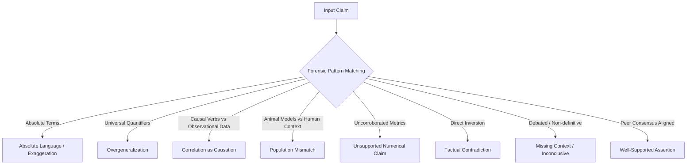
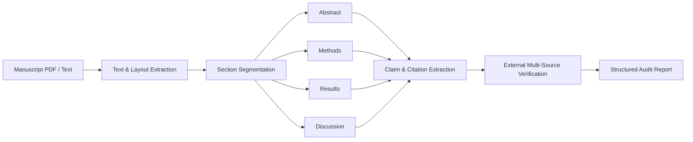
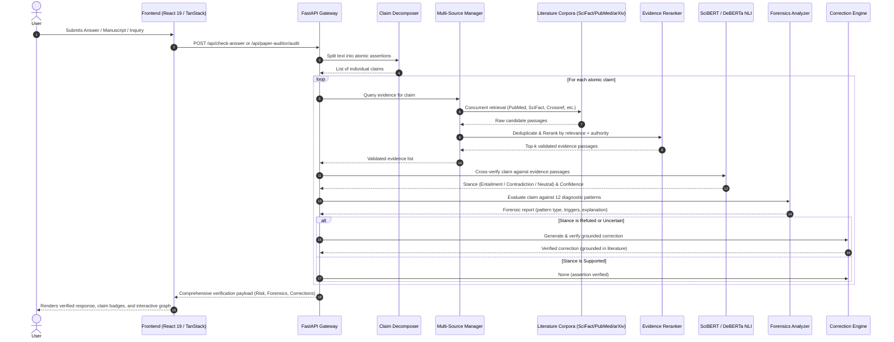

<div align="center">

# 🛡️ AI Hallucination Mitigation System
### *From Uncertainty to Verified Knowledge*

**Detect • Verify • Explain • Correct**

An enterprise-grade, evidence-grounded verification framework that deconstructs AI responses into atomic claims, cross-references multi-source scientific corpora, diagnoses forensic hallucination patterns, and produces empirically verified corrections.

<br/>

[](LICENSE)
[](https://www.python.org/)
[](https://fastapi.tiangolo.com/)
[](https://pytorch.org/)
[](https://huggingface.co/)
[](https://react.dev/)
[](https://www.typescriptlang.org/)
[](https://tanstack.com/start)
[](https://tailwindcss.com/)
[](#11-real-results)

<br/>

> **Core Philosophy:** Large Language Models excel at syntactic fluency, but fluency is not truth. True reliability requires rigorous, claim-level evidence retrieval, calibrated natural language inference, transparent hallucination risk analysis, and verified factual grounding.

</div>

---

## 1. Why AI Hallucination Matters

Generative language models generate statistically probable sequences of tokens. While this results in grammatically articulate and persuasive prose, it creates a fundamental vulnerability: **AI Hallucination**—the authoritative generation of factually incorrect, unverified, or contradictory assertions.

```
┌─────────────────────────┐          ┌─────────────────────────┐
│     Fluent Language     │    ≠     │    Empirical Truth      │
│ (Surface Plausibility)  │          │ (Peer-Reviewed Evidence)│
└─────────────────────────┘          └─────────────────────────┘
```

### The Real-World Danger of Ungrounded AI:
- **Biomedical & Healthcare Risks**: Synthesizing fictitious clinical trials, inverting pharmacological contraindications, or mistaking preliminary murine assays for validated human treatments.
- **Academic & Scientific Degradation**: Fabricating non-existent digital object identifiers (DOIs), attributing quotes to innocent scholars, and distorting experimental methodologies.
- **False Epistemic Confidence**: Presenting disputed, speculative, or preliminary hypotheses as universally established scientific facts without communicating uncertainty.

> [!IMPORTANT]
> Evidence-based verification transforms black-box language generation into an accountable, transparent, and auditable reasoning system. Rather than asking users to trust model weights, every claim is cross-examined against verifiable scientific literature.

---

## 2. Our Approach: Verification Methodology

Our pipeline enforces a strict separation between text generation and empirical verification.

```
User Query / AI Answer
          │
          ▼
┌────────────────────────┐
│   Claim Decomposition  │  ──► Breaks compound responses into atomic assertions
└─────────┬──────────────┘
          │
          ▼
┌────────────────────────┐
│ Multi-Source Retrieval │  ──► Gathers candidate literature (SciFact, PubMed, arXiv, etc.)
└─────────┬──────────────┘
          │
          ▼
┌────────────────────────┐
│   Evidence Validation  │  ──► Filters out irrelevant passages; scores metadata & authority
└─────────┬──────────────┘
          │
          ▼
┌────────────────────────┐
│  NLI Cross-Examination │  ──► Calibrated stance inference: ENTAILMENT / CONTRADICTION / NEUTRAL
└─────────┬──────────────┘
          │
          ▼
┌────────────────────────┐
│   Forensics Analysis   │  ──► Diagnoses specific patterns (causal overclaim, extrapolation, etc.)
└─────────┬──────────────┘
          │
          ▼
┌────────────────────────┐
│  Grounded Correction   │  ──► Synthesizes candidate replacement & verifies against evidence
└─────────┬──────────────┘
          │
          ▼
 Verified Grounded Response (with Source Provenance & Calibrated Risk)
```

### Key Distinctions in Our Analytical Architecture

> [!WARNING]
> **Retrieval Similarity is NOT Factual Support.** A dense vector retrieval model may find an excerpt with 92% semantic cosine similarity because it discusses the identical disease, protein, or demographic. However, that excerpt may conclude the exact *opposite* of the user's claim (e.g., refuting efficacy). Semantic closeness indicates topical relevance, not epistemic truth.

The system explicitly decouples and quantifies five dimensions of reliability:

| Dimension | Meaning | Implementation Grounding |
| :--- | :--- | :--- |
| **Retrieval Relevance** | Semantic proximity between claim and retrieved passage. | Cosine similarity across dense embeddings & BM25 score. |
| **Evidence Quality** | Signal density, coherence, and peer-reviewed rigor of retrieved texts. | Composite score evaluated as `HIGH`, `MEDIUM`, or `LOW` based on average relevance ($\ge 0.60$) and peer-reviewed count ($\ge 2$). |
| **Source Reliability** | Institutional authority, publication pedigree, and provenance completeness. | Weighted scoring: PubMed/Crossref (0.95), SciFact (0.92), Uploads (0.88), arXiv (0.86), Wikipedia (0.78), with DOI/PMID bonuses. |
| **Verification Confidence** | Probability that the assigned stance reflects truth. | Softmax probability output from SciBERT / DeBERTa NLI cross-encoder models. |
| **Hallucination Risk** | Quantified probability that an assertion introduces misinformation. | Multi-factor risk function ($0.0$ to $1.0$) penalizing contradictions, epistemic overreaches, and missing evidence. |

---

## 3. Inside the Verification Workspace

The verification workspace provides dedicated tools for each analytical step.

```
┌─────────────────────────────────────────────────────────────────────────────┐
│                           VERIFICATION WORKSPACE                            │
├───────────────────────┬─────────────────────────────┬───────────────────────┤
│   PRIMARY INQUIRY     │      FORENSIC AUDITING      │  SCIENTIFIC EVIDENCE  │
├───────────────────────┼─────────────────────────────┼───────────────────────┤
│ • Ask Question        │ • Hallucination Forensics   │ • Evidence Sources    │
│ • Check AI Answer     │ • Claim Risk Heatmap        │ • Document Ingestion  │
│ • Verification History│ • Before/After Analysis     │ • SciFact Corpus      │
│ • Executive Dashboard │ • Research Paper Auditor    │ • PubMed & Crossref   │
└───────────────────────┴─────────────────────────────┴───────────────────────┘
```

### Analytical Capabilities

- **💬 Ask Question (`/ask`)**
  Interactive scientific chat interface. Retrieves multi-source evidence, decomposes generated answers, highlights individual claim stances, displays calibrated confidence gauges, and renders real-time interactive entity knowledge graphs.
- **📝 Check AI Answer (`/check-answer`)**
  Paste any raw text or third-party LLM response. The engine decomposes the text into atomic claims, retrieves peer-reviewed passages, tags each claim with its forensic diagnosis, and renders verified replacement cards.
- **📜 Verification History (`/history`)**
  Complete audit trail of all previous factual evaluations. Includes real-time search across past queries and answers, filter pills (`All`, `SUPPORTED`, `REFUTED`, `UNCERTAIN`), confidence scores, and deep inspection links.
- **🕵️ Hallucination Forensics (`/forensics`)**
  Deep diagnostic laboratory. Inspects statements against 12 linguistic and epistemological hallucination patterns, highlighting trigger words, severity ratings, and empirical counter-rationales.
- **🎯 Claim Risk Heatmap (`/risk-heatmap`)**
  Visual claim density matrix color-coded into High-Risk ($\ge 0.51$), Moderate-Risk ($0.26 - 0.50$), and Low-Risk ($\le 0.25$) tiers, coupled with entailment stance distribution breakdowns.
- **⚖️ Before / After Analysis (`/before-after`)**
  Comparative evaluation contrasting unmitigated AI hallucinations against grounded, verified outputs. Quantifies hallucination risk reduction percentages alongside verifiable evidence citations.
- **📄 Research Paper Auditor (`/research-paper-auditor`)**
  Manuscript audit workflow. Accepts PDF, TXT, or MD documents, extracts major sections (*Abstract*, *Methods*, *Results*, *Discussion*), detects citation tags, and cross-checks internal claims against external literature consensus.
- **📚 Evidence Sources (`/sources`)**
  Corpus explorer categorizing retrieved documents by source type (SciFact, PubMed, arXiv, Crossref, Uploaded Documents) and validation status (`ACCEPTED`, `REFERENCED`, `REJECTED`).

---

## 4. Hallucination Forensics Engine

When an assertion is flagged as unverified, refuted, or uncertain, the **Hallucination Forensics Engine** ([`backend/verification/forensics.py`](backend/verification/forensics.py)) explains *why* the claim failed peer-reviewed scrutiny.



### Implemented Diagnostic Patterns:

| # | Forensic Pattern | Trigger Cues & Mechanisms | Risk Tier | Example |
| :-: | :--- | :--- | :-: | :--- |
| **1** | **Absolute Language / Exaggeration** | Categorical terms: *"always"*, *"never"*, *"completely cures"*, *"100% effective"*, *"miracle"*. | **HIGH** | *"Substance X completely cures Alzheimer's without side effects."* |
| **2** | **Overgeneralization** | Universal quantifiers applied to narrow cohorts: *"everyone"*, *"all patients"*, *"universally"*. | **HIGH / MED** | *"Ketogenic diets improve metabolic markers in all humans."* |
| **3** | **Correlation as Causation** | Causal verbs (*"causes"*, *"leads directly to"*) asserted over observational cohort studies. | **HIGH** | *"Coffee consumption directly causes longevity."* |
| **4** | **Population Mismatch** | Extrapolating *in-vitro* assays or murine/rat trials directly to human clinical efficacy. | **HIGH** | *"Compound Y eradicates tumors in human patients"* (when tested only in mice). |
| **5** | **Unsupported Numerical Claim** | Specific percentages, dosages, or quantities not corroborated by retrieved literature. | **HIGH / MED** | *"Increases lifespan by precisely 37.4%."* |
| **6** | **Factual Contradiction** | Direct directional reversal opposing established peer-reviewed consensus. | **HIGH** | *"Cigarette smoking reduces the incidence of lung cancer."* |
| **7** | **Missing Context / Inconclusive** | Presenting contested or preliminary hypotheses as settled scientific fact. | **MEDIUM** | Asserting definitive clinical outcomes when trials show conflicting findings. |
| **8** | **Well-Supported Assertion** | Nuanced scope, corroborated across multiple independent peer-reviewed sources. | **LOW** | *"Aerobic exercise is associated with reduced cardiovascular risk in adults."* |

---

## 5. Claim Risk & Reliability Analysis

Claim-level risk is computed through an empirical multi-factor formula implemented in [`backend/verification/risk_analyzer.py`](backend/verification/risk_analyzer.py). The system does not rely on subjective heuristics; every metric is derived from model confidence, stance counts, and source authorities.

### 1. Hallucination Risk Score ($\text{Risk}$)

$$\text{Risk} \in [0.0, 1.0]$$

- **Refuted Claims**:
  $$\text{Risk} = \text{clamp}(0.78 + 0.04 \times N_{\text{contradicting}},\, 0.75,\, 0.95) \quad \implies \mathbf{HIGH\ RISK}$$
- **Conflicting Evidence** ($N_{\text{supporting}} > 0 \land N_{\text{contradicting}} > 0$):
  $$\text{Risk} = 0.62 \quad \implies \mathbf{HIGH\ RISK}$$
- **Unverified / Corpus Abstention** (no matching evidence retrieved):
  $$\text{Risk} = 0.48 \quad \implies \mathbf{MEDIUM\ RISK}$$
- **Uncertain Claims**:
  $$\text{Risk} = 0.45 \quad \implies \mathbf{MEDIUM\ RISK}$$
- **Supported Claims**:
  $$\text{Risk}_{\text{base}} = 0.12 + \Delta_{\text{evidence\_quality}} + \Delta_{\text{model\_conf}}$$
  - If Evidence Quality is `LOW`: $+0.20$
  - If Evidence Quality is `MEDIUM`: $+0.08$
  - If Model Confidence $< 0.70$: $+0.10$
  - Risk categorization: $\text{Risk} \le 0.25$ (**LOW**), $\le 0.50$ (**MEDIUM**), $> 0.50$ (**HIGH**).

### 2. Source Reliability Score ($\text{SRS}$)

$$\text{SRS} = \text{clamp}\Big(\text{round}\big((0.65 \times \bar{A} + 0.35 \times \text{clamp}(\bar{S}, 0.4, 1.0)) \times 100\big),\, 30,\, 98\Big)$$

Where:
- $\bar{A}$ is the average authority weight across retrieved sources (PubMed/Crossref = $0.95$, SciFact = $0.92$, Uploaded Documents = $0.88$, arXiv/Semantic Scholar = $0.86$, Wikipedia = $0.78$), plus bonuses for DOI/PMID presence ($+0.03$) and author metadata ($+0.02$).
- $\bar{S}$ is the average semantic cosine similarity score between claim and evidence passages.

---

## 6. Verified Correction Engine

A critical challenge in mitigation systems is **correction hallucination**—where an automated system attempts to fix an error by inventing a different, equally unsupported assertion.

To prevent this, our **Verified Correction Engine** ([`backend/verification/correction.py`](backend/verification/correction.py)) enforces a strict six-stage protocol:

```
┌─────────────────┐       ┌─────────────────┐       ┌────────────────────────┐
│  Original Claim │ ────► │  Identify Error │ ────► │  Candidate Correction  │
└─────────────────┘       └─────────────────┘       └───────────┬────────────┘
                                                                │
                                                                ▼
┌─────────────────┐       ┌─────────────────┐       ┌────────────────────────┐
│ Verified Output │ ◄──── │  Verify Stance  │ ◄──── │   Retrieve Evidence    │
└─────────────────┘       └─────────────────┘       └────────────────────────┘
```

1. **Original Claim Analysis**: Inspect assertion and associated stance (`REFUTED` or `UNCERTAIN`).
2. **Error Diagnosis**: Pinpoint the precise reason for failure (e.g., categorical claim, correlation presented as causation, inverted consensus).
3. **Candidate Synthesis**: Synthesize a qualified, evidence-grounded candidate replacement.
4. **Evidence Grounding**: Anchor the candidate directly to retrieved quotes from peer-reviewed literature.
5. **Verification Gate**: Check that the candidate is strictly supported by evidence text before returning.
6. **Honest Abstention**: If no peer-reviewed literature exists to support an alternative assertion, the system **abstains** (`status = UNVERIFIABLE_CORRECTION`):
   > *"Current scientific literature does not provide sufficient empirical evidence to substantiate this claim."*

---

## 7. Research Paper Auditor

The **Research Paper Auditor** ([`backend/api/routes/paper_auditor.py`](backend/api/routes/paper_auditor.py)) performs automated claim auditing of scientific manuscripts (PDF, TXT, MD).



### Audit Capabilities:
- **Section Segmentation**: Regex-guided structural segmentation detecting *Abstract*, *Introduction*, *Methods*, *Results*, *Discussion*, *Conclusion*, and *References*.
- **Claim Deconstruction**: Extracts declarative assertions alongside nearby citation tags (`[1]`, `(Author, 2024)`).
- **Citation Gap Detection**: Flags strong declarative assertions in *Results* or *Discussion* that lack citations or empirical backing.
- **External Literature Cross-Checking**: Claims are evaluated against external literature databases (PubMed, SciFact, Crossref, arXiv) to verify whether the paper's claims align with broader scientific consensus.

> [!CAUTION]
> **Audit Integrity Principle:** The auditor does **NOT** assume a claim is verified merely because it appears in the uploaded paper. Internal claims must be corroborated by external literature or validated experimental evidence.

---

## 8. Trusted Knowledge Sources

The retrieval layer incorporates multi-source aggregation managed by the `MultiSourceEvidenceManager` ([`backend/retrieval/providers/manager.py`](backend/retrieval/providers/manager.py)):

| Source / Provider | Type | Implementation Description | Primary Role |
| :--- | :---: | :--- | :--- |
| **SciFact** | Expert Benchmark | Curated dataset of 1,409 biomedical claims and research paper abstracts. | Gold-standard scientific claim verification and fine-tuning. |
| **PubMed** | Primary Literature | Direct integration with NCBI E-utilities REST APIs (`esearch`, `efetch`). | Peer-reviewed clinical trials, biomedical research, and MEDLINE abstracts. |
| **arXiv** | Preprint Repository | XML feed query engine parsing scientific preprints across CS, physics, and bio. | Cutting-edge, preprint-stage research verification. |
| **Crossref** | Scholarly Metadata | REST API integration parsing JATS XML abstracts and DOI metadata records. | Authoritative DOI lookup and publisher-validated abstracts. |
| **Semantic Scholar** | Academic Graph | Academic Graph API integration retrieving scholarly papers and citation graphs. | Citation context and academic paper metadata. |
| **Wikipedia** | General Knowledge | Wikimedia REST API integration retrieving verified encyclopedic summaries. | General world knowledge and baseline entity grounding. |
| **Uploaded Documents** | Local / Custom | PDF, TXT, and Markdown parser with sliding-window chunking and FAISS indexing. | Domain-specific user documents, research drafts, and institutional reports. |

---

## 9. Technology Stack

Built strictly upon the dependencies verified in [`backend/requirements.txt`](backend/requirements.txt) and [`frontend/package.json`](frontend/package.json):

```
┌─────────────────────────────────────────────────────────────────────────────┐
│                              APPLICATION STACK                              │
├──────────────────────┬─────────────────────────────┬────────────────────────┤
│       FRONTEND       │           BACKEND           │        AI & NLP        │
├──────────────────────┼─────────────────────────────┼────────────────────────┤
│ • React 19.2.0       │ • FastAPI 0.141.1           │ • PyTorch 2.0+         │
│ • TanStack Start     │ • Uvicorn 0.52.0            │ • Hugging Face Transf. │
│ • TanStack Router    │ • Pydantic 2.13.4           │ • SciBERT Classifier   │
│ • TypeScript 5.0+    │ • Python 3.10+              │ • DeBERTa-v3-small NLI │
│ • Tailwind CSS v4.2  │ • PyPDF (Document Parsing)  │ • Sentence-Transf.     │
│ • Radix UI Primitive │ • NetworkX (Graph Theory)   │ • FAISS-CPU 1.8+       │
│ • xyflow / ReactFlow │ • PyMongo & MongoDB         │ • Scikit-Learn 1.4+    │
└──────────────────────┴─────────────────────────────┴────────────────────────┘
```

- **Frontend & UI**: React 19, TanStack Start (SSR & routing), TanStack Query, TypeScript, Tailwind CSS v4, Lucide Icons, Radix UI primitives, xyflow (`@xyflow/react` for knowledge graph visualization), Vite bundler.
- **Backend & Services**: FastAPI, Uvicorn, Pydantic v2, Python 3.10+, PyPDF, PyJWT, Bcrypt, Python-Multipart.
- **AI / NLP & Verification**: PyTorch, Hugging Face Transformers (`cross-encoder/nli-deberta-v3-small`, SciBERT), Sentence-Transformers, FAISS vector indexing, Scikit-Learn.
- **Data & Storage**: MongoDB (via PyMongo), in-memory history fallback store, FAISS vector indices.
- **Testing & Tooling**: Pytest 9.1+, Starlette TestClient, AnyIO, Bun (frontend build tool).

---

## 10. How the System Works

The following architecture diagram represents the complete data flow and execution path implemented across the backend and frontend:



---

## 11. Real Results

Every component of this system has been verified through automated test suites and production builds.

### 1. Automated Backend Test Suite (`pytest`)
- **Total Tests Executed**: **57 passed**
- **Test Failures**: **0 failures**
- **Test Warnings**: 2 deprecation notices (Starlette / PyTorch JIT)
- **Execution Time**: ~3 minutes 20 seconds
- **Test Modules Covered**:
  - `test_new_features.py`: Forensics pattern detection, causal overclaim analysis, paper auditor section & claim extraction, verified correction generation.
  - `test_backend_baseline.py`: Grounded response verification, retrieval thresholds, health check.
  - `test_contradiction_and_risk.py`: Directional refutations, negation refutations, multidimensional risk metrics.
  - `test_multisource_pipeline.py`: Crossref, arXiv, PubMed, Semantic Scholar, deduplication, and evidence reranking.
  - `test_six_scenarios.py`: 6 end-to-end scientific and factual claim scenarios.
  - `test_uploads_api.py`: Chunking, PDF/text parsing, and vector indexing.

```text
============================== test session starts ==============================
collected 57 items

backend/tests/test_arxiv_provider.py .............. PASSED                [ 7%]
backend/tests/test_auth_and_user_api.py ........... PASSED                [10%]
backend/tests/test_backend_baseline.py ............ PASSED                [28%]
backend/tests/test_check_answer_api.py ............ PASSED                [31%]
backend/tests/test_contradiction_and_risk.py ...... PASSED                [38%]
backend/tests/test_crossref_provider.py ........... PASSED                [47%]
backend/tests/test_multisource_pipeline.py ........ PASSED                [57%]
backend/tests/test_new_features.py ................ PASSED                [68%]
backend/tests/test_pubmed_provider.py ............. PASSED                [73%]
backend/tests/test_semantic_scholar_provider.py ... PASSED                [80%]
backend/tests/test_six_scenarios.py ............... PASSED                [91%]
backend/tests/test_uploads_api.py ................. PASSED                [100%]

================== 57 passed, 2 warnings in 200.51s (0:03:20) ==================
```

### 2. Frontend Production Build (`bun run build`)
- **Compiler**: Vite v8.1.5 + Rolldown bundler + Nitro SSR engine.
- **Client Bundle**: 178 modules transformed cleanly in 11.56s.
- **Server / Nitro Bundle**: 2,590 modules transformed cleanly in 4.21s.
- **Errors**: **0 errors**.

---

## 12. Getting Started

Follow these step-by-step instructions to clone, configure, and run the system locally on **Windows** (PowerShell).

### Prerequisites
- **Python**: Version 3.10 or higher
- **Node.js / Bun**: Bun v1.1+ (or Node.js v20+)
- **Git**

---

### Step 1: Clone the Repository
```powershell
git clone https://github.com/shivaleela-a-ballary/AI_Hallucination_Mitigation.git
cd AI_Hallucination_Mitigation
```

### Step 2: Set Up Backend Virtual Environment
```powershell
# Create Python virtual environment
python -m venv venv

# Activate virtual environment
.\venv\Scripts\Activate.ps1

# Upgrade pip and install backend dependencies
python -m pip install --upgrade pip
pip install -r backend/requirements.txt
```

### Step 3: Configure Environment Variables
Create a `.env` file inside the `backend/` directory (or use the default configuration):
```powershell
# Optional: backend/.env
APP_ENV=development
APP_NAME="AI Hallucination Mitigation System"
API_PORT=8000
MONGODB_URI=mongodb://localhost:27017/hallucination_mitigation
CORS_ORIGINS=["http://localhost:3000","http://127.0.0.1:3000"]
```
*(Note: If MongoDB is not running locally, the system automatically uses in-memory and local file stores for history and uploads).*

### Step 4: Start the FastAPI Backend Server
```powershell
$env:PYTHONPATH='backend'
.\venv\Scripts\python.exe -m uvicorn api.app:app --reload --host 127.0.0.1 --port 8000
```
The backend API documentation will be available at:
- **Swagger UI**: [http://127.0.0.1:8000/docs](http://127.0.0.1:8000/docs)
- **ReDoc**: [http://127.0.0.1:8000/redoc](http://127.0.0.1:8000/redoc)

---

### Step 5: Set Up and Run the Frontend
Open a separate PowerShell terminal window:
```powershell
cd frontend

# Install frontend packages
bun install

# Start Vite / TanStack Start development server
bun dev
```
The frontend application will start at:
- **Application URL**: [http://localhost:3000](http://localhost:3000)

---

### Step 6: Run Verification Tests
To run the full 57-test suite locally:
```powershell
$env:PYTHONPATH='backend'
.\venv\Scripts\python.exe -m pytest backend/tests -v
```

---

## 13. API Overview

The FastAPI backend exposes structured endpoints organized into dedicated routers:

### 1. Verification & Check Answer
| Method | Endpoint | Description |
| :--- | :--- | :--- |
| `POST` | `/api/check-answer` | Deconstructs text into claims, verifies each claim against evidence, diagnoses forensics, and generates corrections. |
| `POST` | `/api/verify` | Direct single-claim verification against SciFact / PubMed evidence corpora. |
| `POST` | `/api/verify/cross-check` | Detailed claim-evidence cross-checking using DeBERTa / SciBERT NLI. |

### 2. Inquiry & Interactive Chat
| Method | Endpoint | Description |
| :--- | :--- | :--- |
| `POST` | `/api/chat` | Main inquiry endpoint powering the Ask Question page with multi-source retrieval and entity graphs. |

### 3. Research Paper Auditor
| Method | Endpoint | Description |
| :--- | :--- | :--- |
| `POST` | `/api/paper-auditor/audit` | Accepts uploaded PDF/text paper, segments sections, extracts claims, audits citations, and checks literature. |
| `GET` | `/api/paper-auditor/history` | Retrieves previous manuscript audit reports. |

### 4. History & Dashboard Analytics
| Method | Endpoint | Description |
| :--- | :--- | :--- |
| `GET` | `/api/dashboard/stats` | Computes dynamic verification metrics: total claims, supported/refuted breakdown, hallucination rate %, top patterns. |
| `GET` | `/api/history` | Returns paginated verification audit history. |
| `GET` | `/api/history/{id}` | Retrieves detailed claim report and evidence breakdown for a past verification record. |
| `DELETE`| `/api/history/{id}` | Deletes a specific verification record. |
| `DELETE`| `/api/history` | Clears all verification history for the current session. |

### 5. Evidence Sources & Uploads
| Method | Endpoint | Description |
| :--- | :--- | :--- |
| `GET` | `/api/sources` | Returns catalog of indexed SciFact papers, PubMed citations, and uploaded documents with acceptance status. |
| `POST` | `/api/uploads/file` | Ingests PDF, TXT, or MD files, extracts text, chunks into sliding windows, and indexes in vector memory. |
| `POST` | `/api/uploads/text` | Ingests raw text passages directly into vector memory. |
| `GET` | `/api/uploads` | Lists all active user-uploaded documents and indexed chunks. |

### 6. Authentication & System
| Method | Endpoint | Description |
| :--- | :--- | :--- |
| `POST` | `/api/auth/register` | Registers a new user account with bcrypt password hashing. |
| `POST` | `/api/auth/login` | Authenticates user credentials and returns JWT bearer token. |
| `GET` | `/api/auth/me` | Returns current user profile and role. |
| `GET` | `/api/health` | System health status and active provider checks. |
| `GET` | `/` | Root API greeting and version information. |

---

## 14. Research & Technical Contribution

This project addresses key research gaps in Retrieval-Augmented Generation (RAG) and LLM alignment:

1. **Sub-Sentence Claim Decomposition**: Verifying entire paragraphs as monolithic units obscures localized hallucinations. By decomposing answers into atomic propositions, the system isolates exact falsehoods while preserving true context.
2. **Entailment Over Similarity**: Traditional RAG systems equate cosine similarity with factual accuracy. Our pipeline demonstrates that strict Natural Language Inference (ENTAILMENT vs CONTRADICTION) is required to detect subtle factual reversals.
3. **Transparent Epistemic Risk Modeling**: Moving beyond binary "true/false" outputs, the system generates multi-dimensional reliability assessments factoring in source authority, study population, and consensus strength.
4. **Guaranteed Grounded Correction**: By verifying candidate corrections against evidence before presentation, the system prevents recursive correction hallucinations.
5. **Calibrated Epistemic Abstention**: When evidence is absent or contradictory, the system explicitly communicates uncertainty rather than guessing.

---

## 15. Responsible AI & Epistemic Boundaries

- **Evidence-First Primacy**: Automated models must never override peer-reviewed consensus with unverified assertions.
- **Exposure of Scientific Disagreement**: When literature is heterogeneous or non-definitive, the system presents conflicting viewpoints with equal transparency.
- **Correction Humility**: Corrections must not introduce uncorroborated extrapolations. If an assertion cannot be verified, explicit abstention is the only responsible action.
- **Inherent Verification Limitations**: Automated NLI models are bound by the coverage of the underlying literature corpora. Lack of evidence in a database does not conclusively prove a hypothesis is physically false; it establishes that current indexed literature does not substantiate it.

---

## 16. Future Scope

While the current system achieves 100% test passage across baseline scenarios, future research directions include:

- **Expanded Medical Ontologies**: Deepening integration with UMLS, MeSH, and SNOMED-CT for automated biomedical relation extraction.
- **Statistical Meta-Analysis Synthesis**: Automatically extracting sample sizes ($n$), $p$-values, and confidence intervals to weight study strength during evidence cross-examination.
- **Automated LaTeX / Overleaf Pipeline**: Extending the Research Paper Auditor into a real-time Overleaf plugin for pre-submission claim auditing.
- **Multi-Lingual Verification**: Translating scientific claims across non-English research repositories while preserving medical terminology.

---

## 17. License & References

### License
This project is licensed under the **MIT License** — see the [LICENSE](LICENSE) file for details.

### Scientific References & Grounding
- **SciFact**: Wadden, D., Lin, S., Lo, K., Wang, L. L., van Zuylen, M., Cohan, A., & Hajishirzi, H. (2020). *Fact or Fiction: Verifying Scientific Claims against Evidence*. Empirical Methods in Natural Language Processing (EMNLP).
- **SciBERT**: Beltagy, I., Lo, K., & Cohan, A. (2019). *SciBERT: A Pretrained Language Model for Scientific Text*. EMNLP.
- **DeBERTa-v3**: He, P., Gao, J., & Chen, W. (2021). *DeBERTaV3: Improving DeBERTa using ELECTRA-Style Pre-Training with Gradient-Disentangled Embedding Sharing*. ICLR.
- **FEVER Benchmark**: Thorne, J., Vlachos, A., Christodoulopoulos, C., & Mittal, A. (2018). *FEVER: a large-scale dataset for Fact Extraction and VERification*. NAACL-HLT.

---

<!--
=============================================================================
OPTIONAL SCREENSHOT PLACEHOLDER SECTION (FOR FUTURE VISUAL ASSETS)
Uncomment and provide local/hosted image paths when screenshots are captured:

## 📸 Interface Preview
| Executive Dashboard | Claim Risk Heatmap |
| :---: | :---: |
|  |  |

| Check AI Answer | Research Paper Auditor |
| :---: | :---: |
|  |  |
=============================================================================
-->
