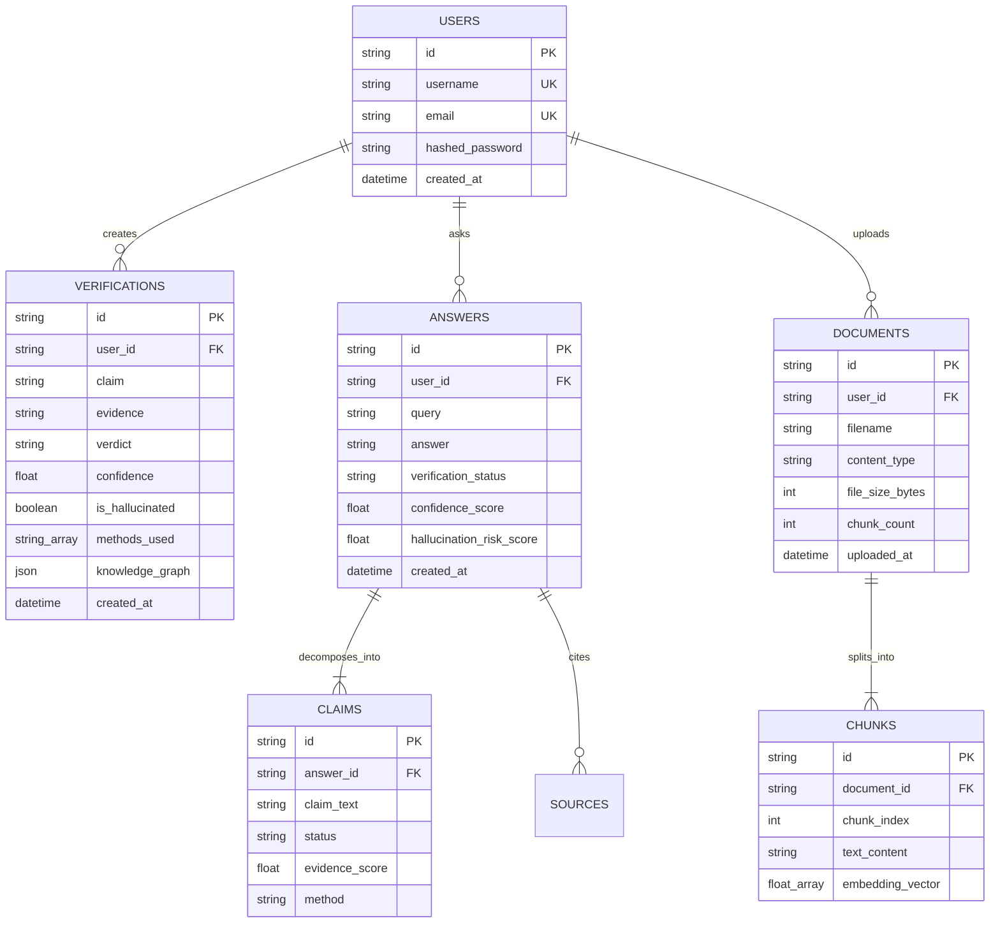

# Database Documentation
## AI Hallucination Mitigation System (v2.0.0)

---

## 1. Database Architecture & Dual-Mode Strategy

The system implements a **Dual-Mode Persistence Architecture** managed by `backend/api/database.py` (`DatabaseManager`):

1. **Mode A: Cloud MongoDB Atlas (Primary)**
   - Utilizes asynchronous `motor.motor_asyncio.AsyncIOMotorClient` and synchronous `pymongo.MongoClient`.
   - Activated automatically whenever the `MONGODB_URI` environment variable is defined and reachable.
   - Provides durable document storage, multi-user isolation, and indexing.

2. **Mode B: Thread-Safe In-Memory Store (Fallback)**
   - Activated automatically when `MONGODB_URI` is unconfigured, invalid, or during offline development.
   - Emulates MongoDB collections using Python dictionaries and lists with `threading.Lock` concurrency guards.
   - Ensures zero startup crashes and maintains full API functionality during local demonstrations.

```
                  ┌────────────────────────────────────────┐
                  │    FastAPI Application Lifespan        │
                  └──────────────────┬─────────────────────┘
                                     │
                                     ▼
                  ┌────────────────────────────────────────┐
                  │   Check MONGODB_URI Config Variable    │
                  └──────────┬───────────────────┬─────────┘
                             │                   │
                     Valid URI Present     URI Not Present /
                             │             Connection Fails
                             ▼                   ▼
                  ┌──────────────────────┐┌──────────────────────┐
                  │  MongoDB Atlas Mode  ││   In-Memory Mode     │
                  │  (Motor / PyMongo)   ││ (Python Dicts / Lock)│
                  └──────────────────────┘└──────────────────────┘
```

---

## 2. Entity-Relationship (ER) Diagram



---

## 3. Detailed Collection Schemas

### 3.1 Collection: `verifications`
- **Description:** Stores individual claim verification records, stance outputs, and knowledge graphs.
- **Fields:**
  - `_id` / `id` (String / ObjectId, PK): Unique verification record identifier.
  - `user_id` (String, Optional, FK): References `users.id`.
  - `claim` (String, Required): The factual claim under evaluation.
  - `evidence` (String, Optional): The premise evidence passage provided or retrieved.
  - `verdict` (String, Required): Enum `SUPPORTED`, `REFUTED`, `UNCERTAIN`.
  - `confidence` (Float, Required): Scaled confidence score ($0.0 \dots 1.0$).
  - `is_hallucinated` (Boolean, Required): True if verdict is `REFUTED`.
  - `methods_used` (Array of Strings): Verification heads applied (`cross_encoder`, `semantic_similarity`, etc.).
  - `knowledge_graph` (Object): `{ nodes: Array, edges: Array }` for visual graph rendering.
  - `created_at` (DateTime / ISO String): Creation timestamp.
- **Indexes:**
  - Index on `{ created_at: -1 }` (Descending for fast history pagination).
  - Index on `{ user_id: 1, created_at: -1 }`.

---

### 3.2 Collection: `answers`
- **Description:** Stores full grounded Q&A and answer-checking sessions.
- **Fields:**
  - `_id` / `id` (String / ObjectId, PK): Unique answer session identifier.
  - `user_id` (String, Optional, FK): User attribution.
  - `query` (String, Required): User question or input prompt.
  - `answer` (String, Required): Generated or audited response text.
  - `verification_status` (String, Required): `SUPPORTED`, `CONTRADICTED`, `UNCERTAIN`.
  - `confidence_score` (Float, Required): Overall answer confidence ($0.0 \dots 1.0$).
  - `hallucination_risk_score` (Float, Required): Risk score ($0.0 \dots 1.0$).
  - `claims` (Array of Objects): Decomposed atomic claims with individual verification verdicts.
  - `sources` (Array of Objects): Retrieved grounding passages with citations and URLs.
  - `created_at` (DateTime / ISO String): Timestamp.
- **Indexes:**
  - Index on `{ created_at: -1 }`.

---

### 3.3 Collection: `documents`
- **Description:** Stores uploaded document metadata and chunked vector embeddings.
- **Fields:**
  - `_id` / `id` (String / ObjectId, PK): Unique document identifier.
  - `filename` (String, Required): Original filename (e.g., `research_paper.pdf`).
  - `file_type` (String, Required): Extension/MIME (`pdf`, `txt`, `md`, `docx`, `csv`).
  - `file_size_bytes` (Integer, Required): Raw file size.
  - `chunk_count` (Integer, Required): Number of extracted 500-token chunks.
  - `chunks` (Array of Objects): Each containing `{ chunk_index, text, embedding_vector }`.
  - `uploaded_at` (DateTime / ISO String): Ingestion timestamp.
- **Indexes:**
  - Index on `{ uploaded_at: -1 }`.
  - Vector search index on `chunks.embedding_vector` (384 dimensions, Cosine distance).

---

### 3.4 Collection: `users`
- **Description:** Stores user accounts, bcrypt password hashes, and preferences.
- **Fields:**
  - `_id` / `id` (String / ObjectId, PK): Unique user identifier.
  - `username` (String, Required, Unique): User login handle.
  - `email` (String, Required, Unique): User email address.
  - `hashed_password` (String, Required): Bcrypt salted password hash.
  - `created_at` (DateTime / ISO String): Account registration date.
- **Indexes:**
  - Unique Index on `{ username: 1 }`.
  - Unique Index on `{ email: 1 }`.
